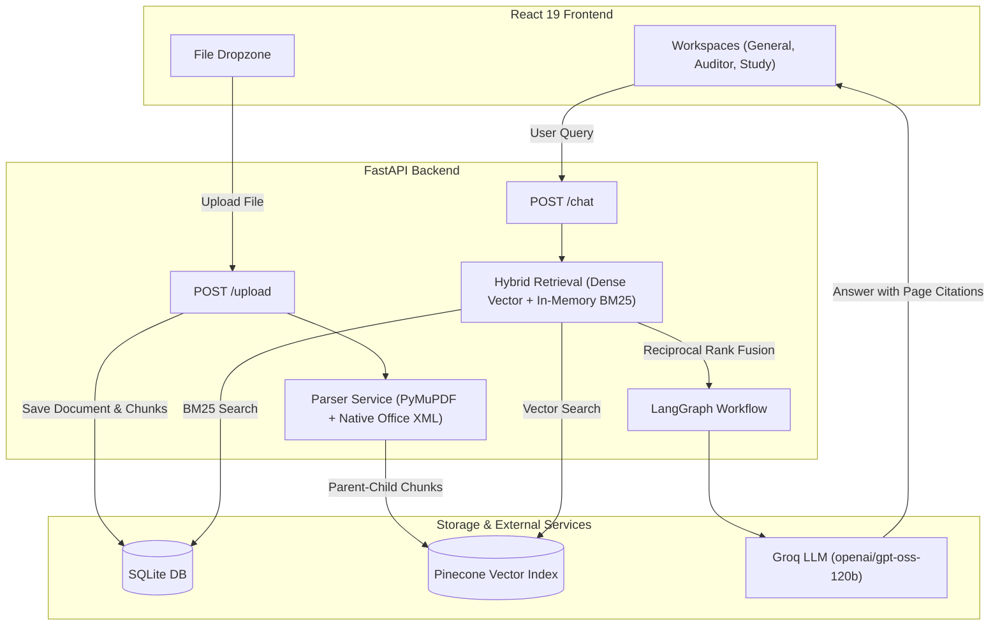

# 📄 Docent

**Docent** is a multi-workspace document intelligence and RAG platform. Instead of a single generic chatbot trying to answer everything the same way, Docent gives you **specialized AI workspaces** tailored for specific types of documents and tasks—like auditing commercial contracts, studying textbooks with spaced repetition, or running general research with exact page citations.

---

## 🏗️ How It Works

Docent is built with a decoupled architecture: a **React 19 + Tailwind CSS** frontend communicating asynchronously with a **FastAPI + LangGraph + Pinecone** backend.



---

## 🧠 Workspaces

| Workspace | Status | Chunking | Retrieval Mode | What It Does |
|---|---|---|---|---|
| **💬 General Chat** | 🟢 Live | Parent: 1200 / Child: 300 | Hybrid RRF | Multi-page Q&A with exact clickable `[p.X]` page citations and 3D concept graph visualization. |
| **🛡️ Contract Auditor** | 🟢 Live | Parent: 1000 / Child: 200 | Hybrid (BM25 Dominant) | Scans contracts for 10 missing commercial safeguards, generates a 4-axis risk radar, and proposes redlines. |
| **🎓 Spaced Learning** | 🟢 Live | Parent: 1500 / Child: 500 | Hybrid RRF | Extracts flashcards, tracks memory decay with SuperMemo SM-2 curves, and compiles closed-book quizzes. |
| **📊 Spreadsheet Analytics** | 🟡 Preview (WIP) | Row-by-Row Chunks | Hybrid | Extracts variables from spreadsheets, runs 150-run Monte Carlo simulations, and solves Goal-Seek equations. |
| **💼 CV / Interview Simulator** | 🟡 Preview (WIP) | Full Document | Document Context | Analyzes resumes against ATS keywords, evaluates STAR answers, and tracks verbal confidence metrics. |

---

## ⚡ Key Technical Features

### 1. Zero-Dependency Office Ingestion
Word (`.docx`), PowerPoint (`.pptx`), and Excel (`.xlsx`) files are parsed using native Python `zipfile` and `xml.etree.ElementTree`. This keeps the backend fast and lightweight on any platform without requiring heavy binary dependencies. PDFs are parsed via PyMuPDF with RapidOCR fallback for scanned pages.

### 2. Hybrid Retrieval with Reciprocal Rank Fusion (RRF)
To combine semantic meaning with exact keyword and clause lookups, Docent uses Reciprocal Rank Fusion with constant `k = 60`:
```text
RRF_Score(d) = Σ [ 1.0 / (60 + rank_m(d)) ]
```
This fuses dense Pinecone vector embeddings with in-memory BM25 lexical inverted indices, ensuring exact clause references and broad concepts are both captured.

### 3. Real Calculation Engines
- **SuperMemo SM-2 & Forgetting Decay**: Calculates card retrievability `R = exp(-Δt / half_life)` and updates intervals based on user review performance.
- **Contract Safeguard Scanner**: Scans text against 10 critical commercial protection categories (*Indemnification*, *Limitation of Liability*, *Termination*, *Force Majeure*, etc.).
- **Monte Carlo Simulator**: Runs 150 Gaussian-perturbed iterations across variables to plot probability distributions.

---

## 🛠️ Tech Stack

- **Frontend**: React 19, Vite, Tailwind CSS v4, Three.js / React Force Graph, Lucide Icons
- **Backend**: FastAPI, SQLAlchemy (Async), aiosqlite, LangGraph, LangChain Core
- **Vector Database**: Pinecone Cloud (Serverless)
- **LLM Inference**: Groq API
- **Document Parsers**: PyMuPDF, RapidOCR ONNX, Native Python Zip/XML Parsers

---

## 🚀 Getting Started

### Prerequisites
- Python 3.11+
- Node.js 18+ & npm
- Groq API Key ([console.groq.com](https://console.groq.com/keys))
- Pinecone API Key ([app.pinecone.io](https://app.pinecone.io/))

### 1. Clone & Setup Backend
```bash
git clone https://github.com/abhiteksingh/Docent.git
cd Docent

# Create virtual environment
python -m venv backend/venv
# Windows:
backend\venv\Scripts\activate
# Linux/macOS:
# source backend/venv/bin/activate

# Install requirements
pip install -r requirements.txt

# Setup environment variables
cp .env.example .env
# Open .env and add your GROQ_API_KEY and PINECONE_API_KEY
```

### 2. Setup Frontend
```bash
cd frontend
npm install
```

### 3. Run Locally

**Start Backend Server:**
```bash
# In workspace root:
backend\venv\Scripts\python -m uvicorn backend.app.main:app --reload --port 8000
```

**Start Frontend Client:**
```bash
# In frontend directory:
npm run dev
```
Open [http://localhost:5173](http://localhost:5173) in your browser.

---

## 🧪 Running Tests

To run the full backend integration test suite covering all 15 workflow validation stages:

```bash
backend\venv\Scripts\python backend/test_app.py
```

---

## 📜 License
Distributed under the MIT License. See `LICENSE` for details.
